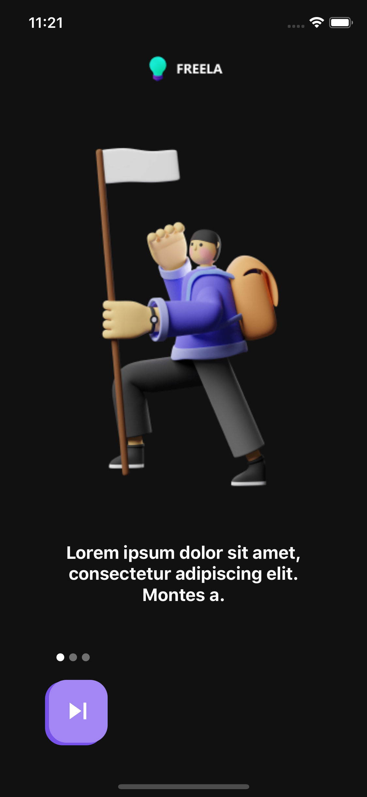
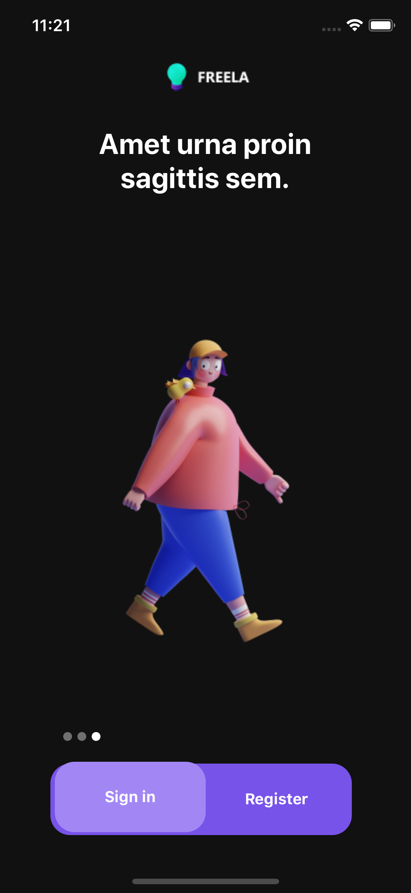
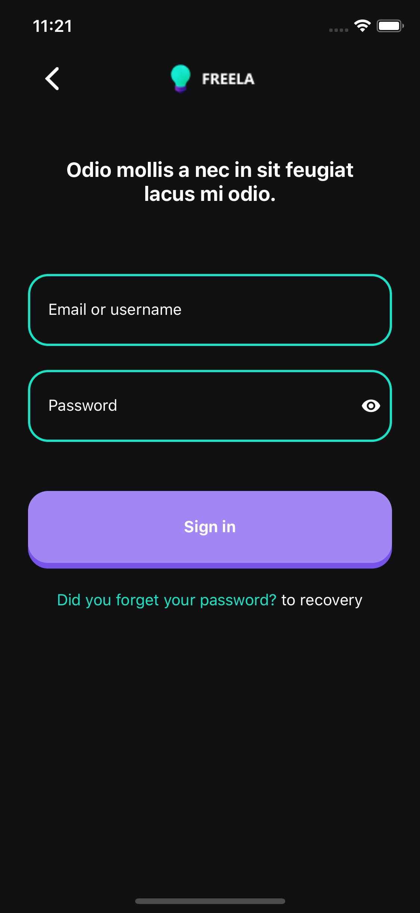
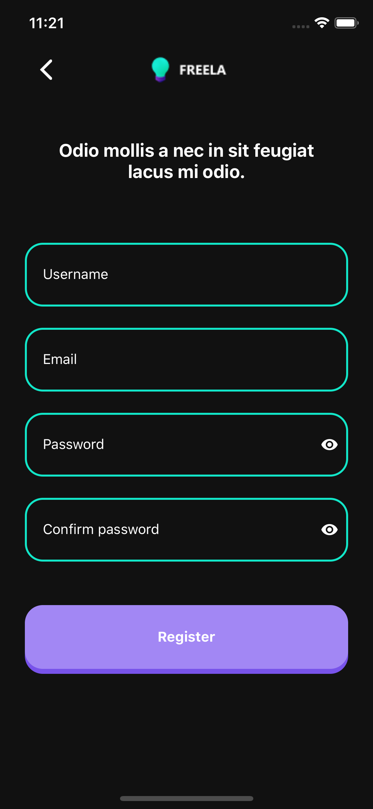
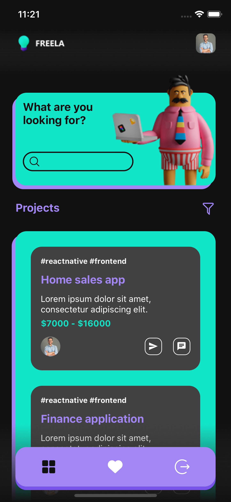
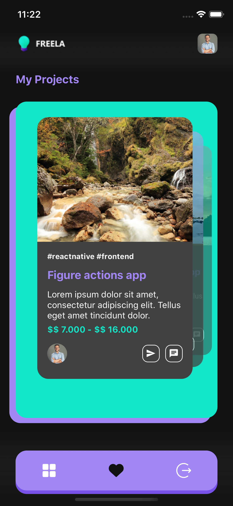

# Freelance Projects

<p align="center">
Freelance projects is an application aimed at accessing the details of autonomous projects and sending proposals.</p>

<p align="center">
  <a href="https://github.com/MarlonBeloMarques">
    
  </a>
</p>


<p align="center">
    
    
    
    
    
    
    
</p>

---

| Project | Preview | Screens | Estimation | Status |
| ------ | :------: | :------: | :------: | :------: |
| [Share Work Environments](https://www.figma.com/file/VkccwKi1HxnL0nG4RCixkg/interfacetemplates-freelance-projects?node-id=2%3A875) |  | 5 | ~16 hours | :white_check_mark: |

---

## 🚀 Starting

### Prerequisites


- To run any React Native / Expo application, you need to configure the environment on your machine.

- Defining the environment is a complex process, so I recommend following the Expo documentation:

#### [**Expo Introduction**](https://expo.io/learn)


### Clone

- Clone this repository on your machine

```
https://github.com/MarlonBeloMarques/freelanceprojects-reactnative
```
### Getting Started

- `$ yarn install`
- `$ yarn start`

## 📌 Support

Please contact me at one of the following places!

- Instagram on [@marlomarquesbr](https://www.instagram.com/marlonmarqsbr/)
- Linkedin on [Marlon Marques](https://www.linkedin.com/in/marlon-marques-0b509813b/)
